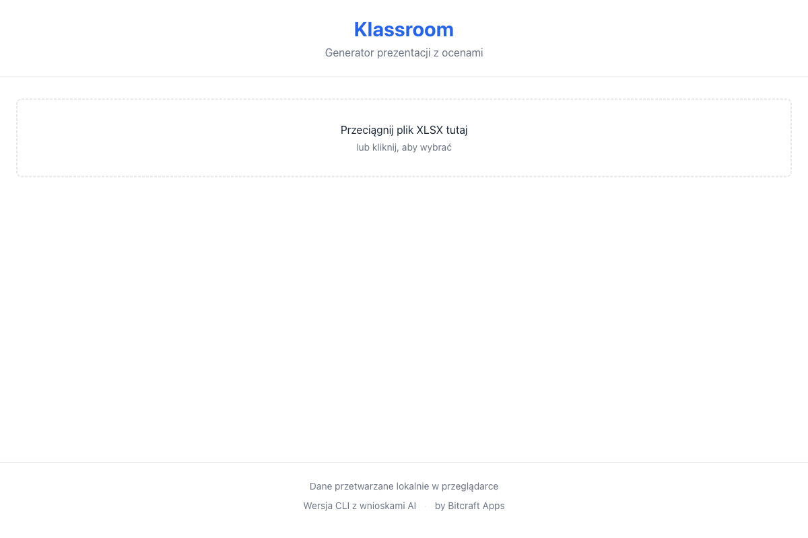
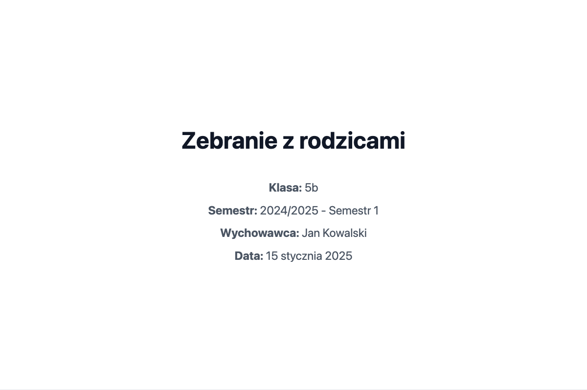
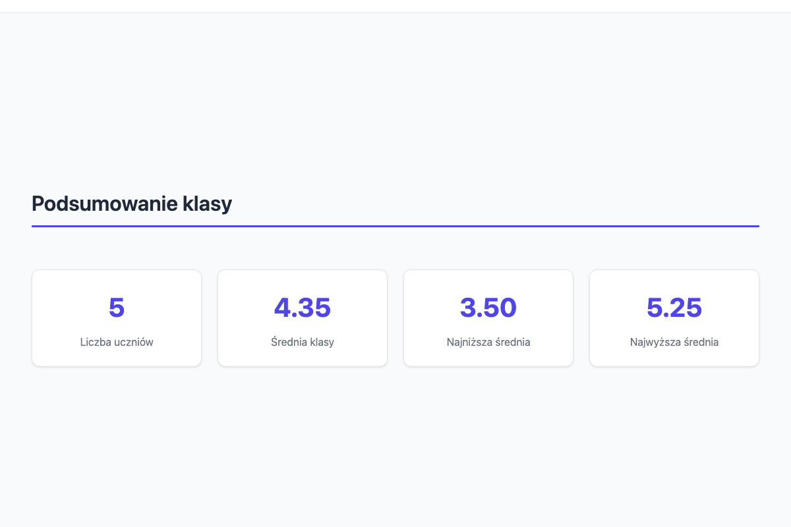
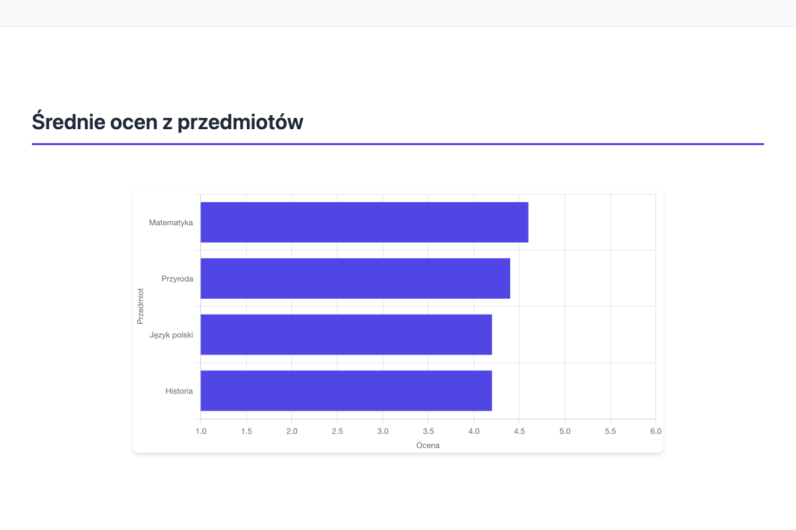

# Klassroom

Generate HTML semester presentations from Polish school grade exports.



**[Try the Web App](https://klassroom.graczyk.dev/)** | **[CLI with AI Conclusions](#cli-usage)**

## Features

- 📊 **Beautiful Charts**: Automatically generated grade distributions and attendance stats.
- 🇵🇱 **Polish Language**: All output (charts, labels, UI) is in Polish.
- 🔒 **GDPR Compliant**: Processes data locally, outputting only student numbers (no names).
- 🏫 **Vulcan UONET+ Support**: Native support for the "Internal Documentation" XLSX export.
- 🤖 **AI Conclusions** (CLI only): Generate intelligent summaries with Google Gemini free tier.

## Web App

The easiest way to use Klassroom is via the web app at **[klassroom.graczyk.dev](https://klassroom.graczyk.dev/)**:

1. Open the web app in your browser
2. Upload your Vulcan UONET+ XLSX export
3. Download the generated HTML presentation

All processing happens locally in your browser - no data is sent to any server.

### Generated Presentation







## CLI Usage

For advanced features like AI-powered conclusions, use the command-line interface.

### Installation

**Prerequisites**

- Node.js >= 22
- pnpm

```bash
# Clone the repository
git clone https://github.com/bitcraft-apps/klassroom.git
cd klassroom

# Install dependencies
pnpm install

# Build all packages
pnpm build
```

### Basic Usage

The CLI generates a standalone HTML presentation file in the same directory as your input file.

```bash
# Run the CLI via node
node packages/cli/dist/cli.js generate path/to/grades.xlsx

# Output will be created at: path/to/grades.html
```

You can also link the executable globally for easier access:

```bash
cd packages/cli
pnpm link --global
klassroom generate path/to/grades.xlsx
```

### CLI Reference

**`klassroom generate <xlsx-path> [options]`**

Generates an HTML presentation from the provided Vulcan XLSX file.

**Arguments:**

- `<xlsx-path>`: Path to the Vulcan UONET+ XLSX export file.

**Options:**

- `-d, --date <date>`: Custom meeting date for the title slide.
- `--ai`: Generate AI-powered conclusions (requires `GEMINI_API_KEY`).

_Example:_

```bash
klassroom generate ./exports/semestr1.xlsx
# -> ./exports/semestr1.html

# With custom date and AI conclusions
klassroom generate --ai --date "15 stycznia 2025" ./exports/semestr1.xlsx
```

### AI Conclusions (CLI Only)

Generate intelligent class summaries using Google Gemini (free tier, no credit card required):

1. Get an API key from [Google AI Studio](https://aistudio.google.com/)
2. Set the environment variable:
   ```bash
   export GEMINI_API_KEY=your_key
   ```
3. Run with the `--ai` flag:
   ```bash
   klassroom generate --ai grades.xlsx
   ```

The AI analyzes aggregate class statistics and generates Polish-language conclusions with strengths, areas for improvement, and recommendations.

## Supported Formats

- ✅ **Vulcan UONET+**: Fully supported. Requires "Internal Documentation" export (additional sheets like "Okres klasyfikacyjny").
- 🚧 **Librus Synergia**: Planned (Not yet implemented).

## Privacy & GDPR

This tool is designed with student privacy as a priority:

- **Local Processing**: All parsing and generation happens on your machine (or in your browser for the web app). No data is sent externally by default.
- **Anonymized Output**: The generated HTML file refers to students only by their journal number ("Nr w dzienniku"). Student names are used internally for parsing but are **never** included in the output.
- **AI Mode (`--ai`)**: When enabled, only aggregate class statistics (averages, distributions, counts) are sent to Google Gemini. Individual student data (names, numbers, grades) is never transmitted.

## License

MIT © Bitcraft Apps
